# 🏢 SynapseHR — Enterprise Employee Management System

<div align="center">

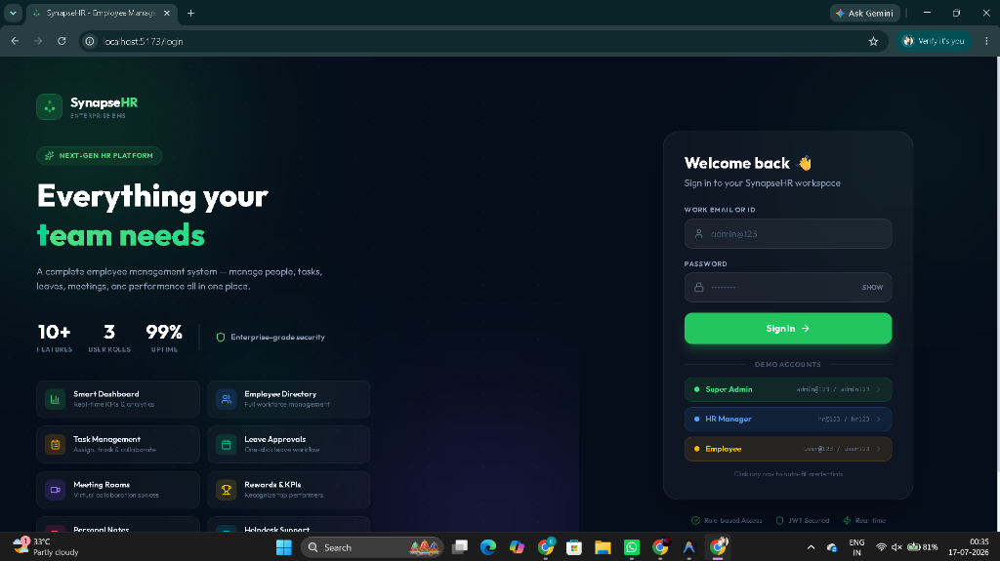

**A full-stack, modern Employee Management System built with React, TypeScript, Node.js, Express & MongoDB**

[](https://www.typescriptlang.org/)
[](https://reactjs.org/)
[](https://nodejs.org/)
[](https://expressjs.com/)
[](https://www.mongodb.com/)
[](https://tailwindcss.com/)

</div>

---

## ✨ Features

### 👤 Three Role-Based Access Levels
| Role | Access |
|------|--------|
| **Super Admin** | Full system access — all features, all data, all employees |
| **HR Manager** | Employee management, leave approvals, task assignment, announcements |
| **Employee** | Personal dashboard, tasks, leaves, meetings, notes, helpdesk |

---

## 📸 Screenshots

### 🔐 Login Page — Dark Mode


### 🌤️ Login Page — Light Mode
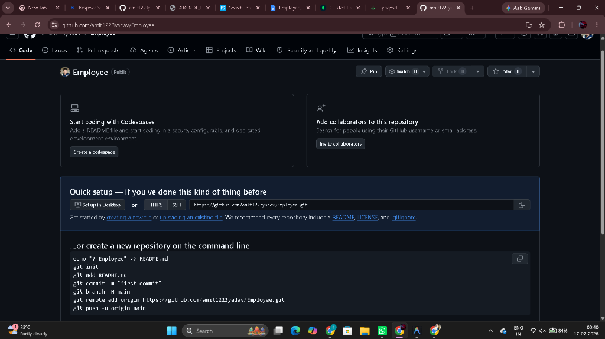

### 📊 Admin Dashboard
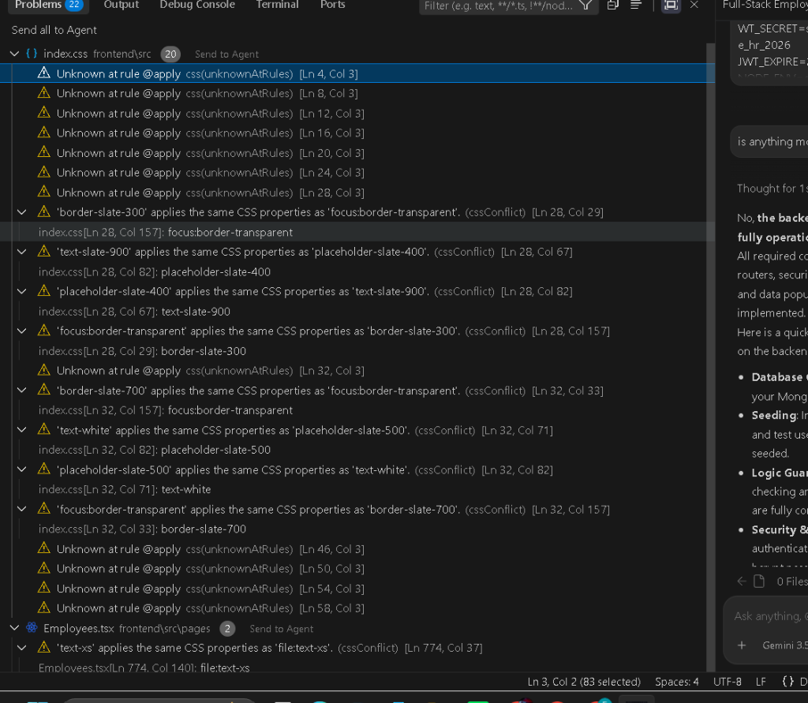

### 👥 Employee Directory
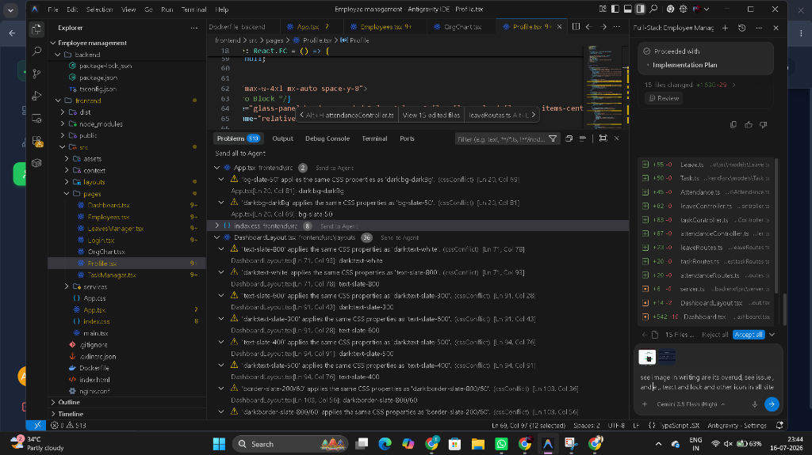

### 👤 Employee Profile
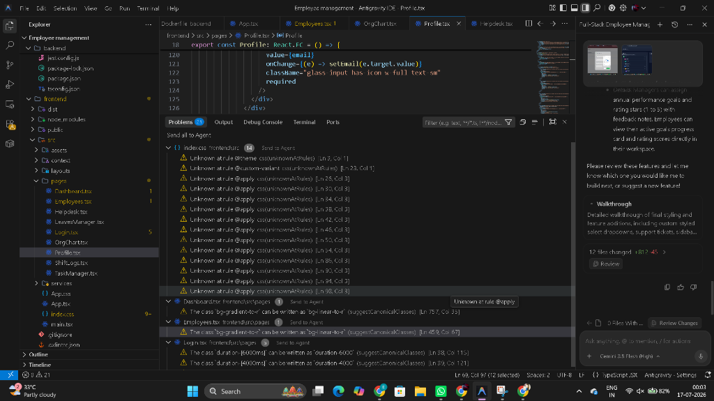

### ✅ Task Manager
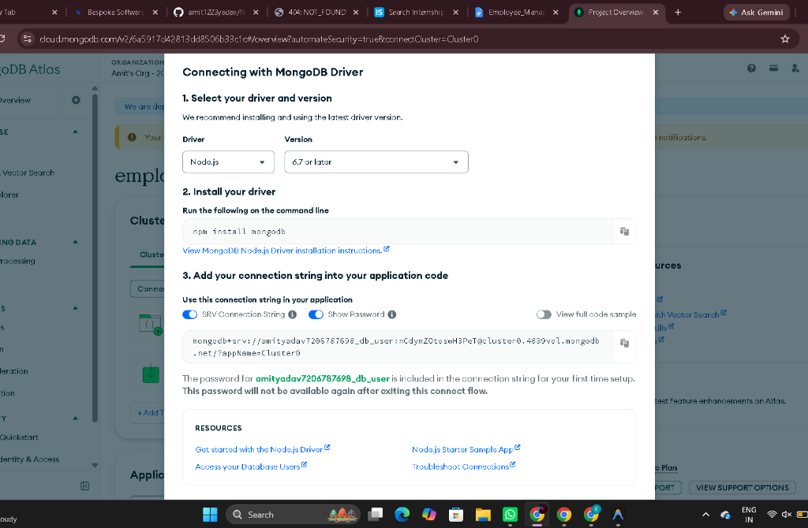

### 🏖️ Leave Approvals
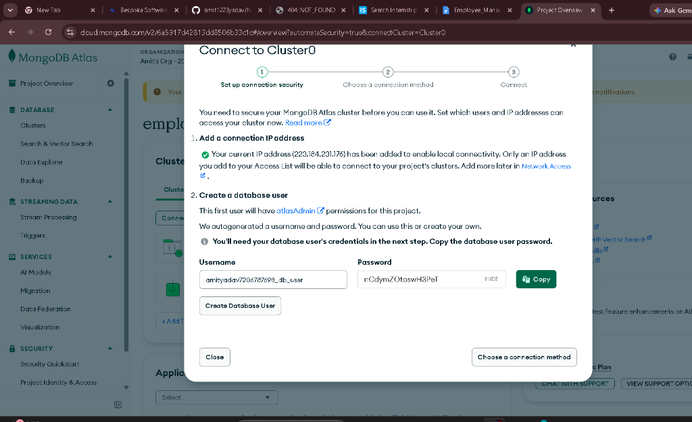

### 🎫 Helpdesk Tickets
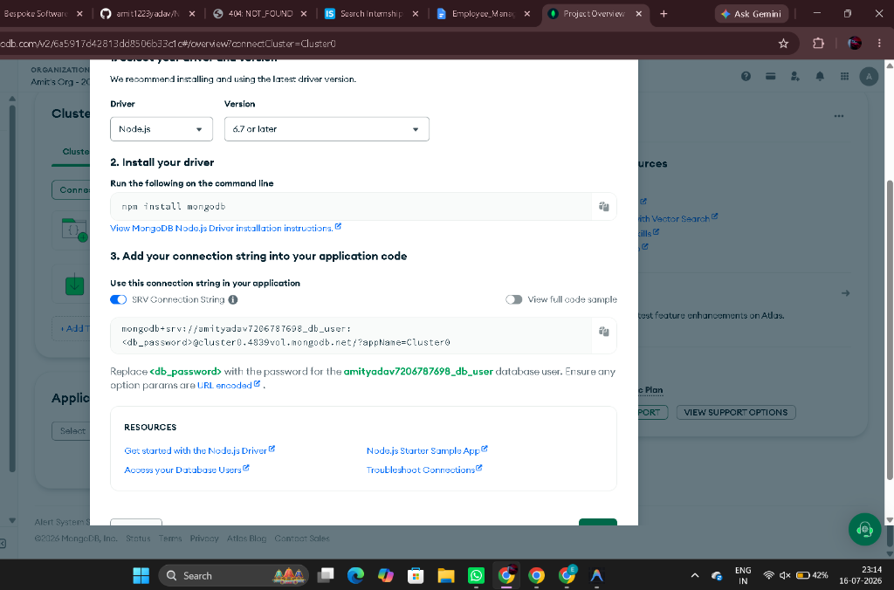

### 🏗️ Organization Chart
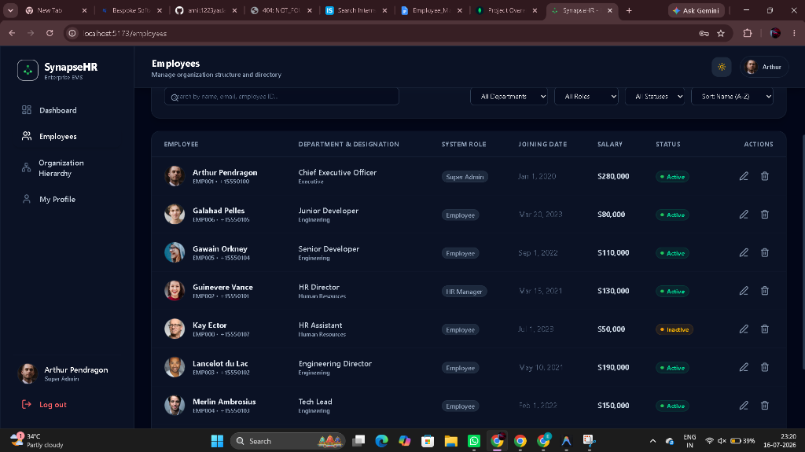

### 🕐 Shift Logs & Attendance
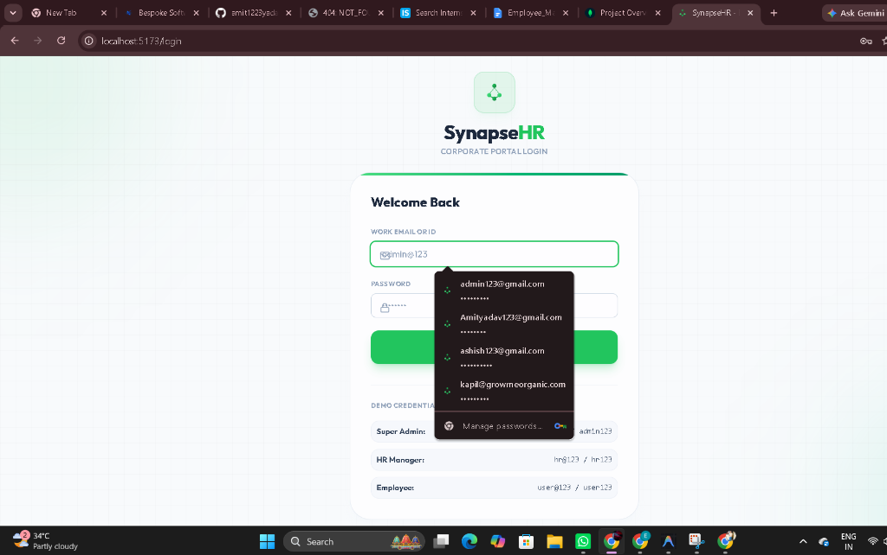

### ➕ Add Employee Form
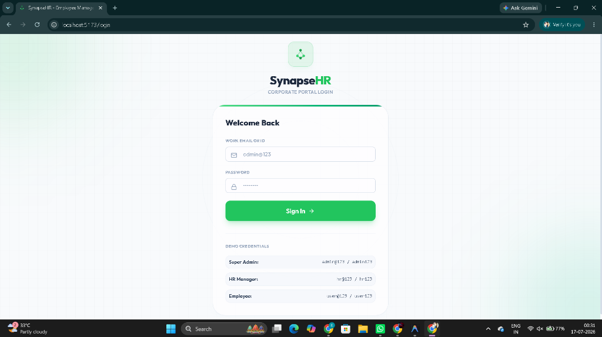

### 📈 Dashboard Analytics
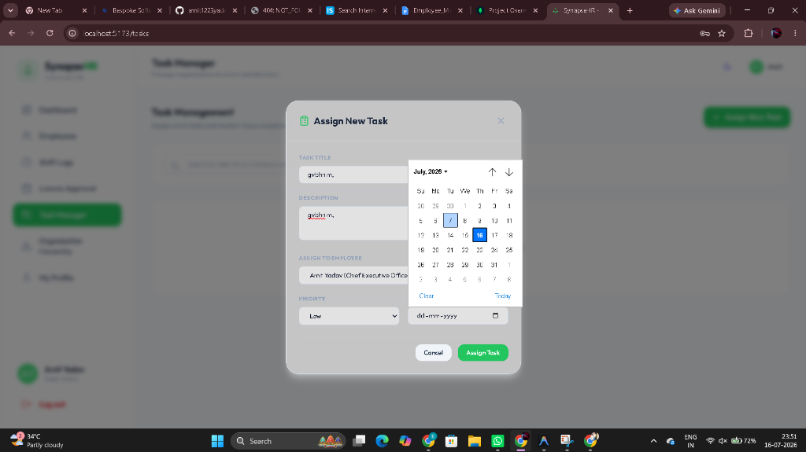

---

## 🚀 Tech Stack

### Frontend
- **React 18** + **TypeScript** — Component-based UI
- **Vite** — Lightning-fast dev server & build tool
- **Tailwind CSS v4** — Utility-first styling with custom design tokens
- **Recharts** — Interactive charts & analytics
- **Lucide React** — Beautiful icon library
- **React Router v6** — Client-side routing

### Backend
- **Node.js** + **Express.js** — REST API server
- **TypeScript** — Type-safe backend
- **MongoDB** + **Mongoose** — Database & ODM
- **JWT** — Secure JSON Web Token authentication
- **bcryptjs** — Password hashing

---

## 📦 Modules & Pages

| Module | Route | Description |
|--------|-------|-------------|
| 🔐 Login | `/login` | Premium split-panel login with demo credentials |
| 📊 Dashboard | `/` | Role-specific dashboard with KPIs and analytics |
| 👥 Employees | `/employees` | Employee directory with add/edit/search/filter |
| 📋 Task Manager | `/tasks` | Assign, edit, delete tasks; track completion rates |
| 🏖️ Leave Manager | `/leaves` | Apply for leaves; HR/Admin approval workflow |
| 🕐 Shift Logs | `/attendance` | Clock-in/clock-out attendance tracking |
| 📹 Meeting Rooms | `/meetings` | Create virtual meeting rooms with room codes |
| 🏆 Rewards & KPI | `/rewards` | Achievements, KPI cards, team announcements |
| 📝 Personal Notes | `/notes` | Google Keep-style colorful sticky notes |
| 🎫 Helpdesk | `/helpdesk` | Submit and track support tickets |
| 🏗️ Org Chart | `/org-chart` | Visual organizational hierarchy |
| 👤 Profile | `/profile` | Update profile, view payslips |

---

## 🛠️ Getting Started

### Prerequisites
- Node.js v18+
- MongoDB (local or [MongoDB Atlas](https://www.mongodb.com/atlas))
- npm or yarn

### 1. Clone the Repository
```bash
git clone https://github.com/amit1223yadav/Employee.git
cd Employee
```

### 2. Setup Backend
```bash
cd backend
npm install
```

Create a `.env` file in the `backend/` directory:
```env
PORT=5000
MONGODB_URI=your_mongodb_connection_string
JWT_SECRET=your_super_secret_jwt_key
NODE_ENV=development
```

Start the backend:
```bash
npm run dev
```

### 3. Setup Frontend
```bash
cd frontend
npm install
npm run dev
```

The app will be available at **http://localhost:5173**

---

## 🔑 Demo Credentials

| Role | Email/ID | Password |
|------|----------|----------|
| Super Admin | `admin@123` | `admin123` |
| HR Manager | `hr@123` | `hr123` |
| Employee | `user@123` | `user123` |

> 💡 **Tip:** On the login page, click any demo account row to auto-fill credentials!

---

## 📁 Project Structure

```
Employee/
├── backend/                   # Express + TypeScript API
│   ├── src/
│   │   ├── controllers/       # Route handlers
│   │   ├── models/            # Mongoose schemas
│   │   ├── routes/            # Express routers
│   │   ├── middleware/        # Auth middleware
│   │   └── server.ts          # App entry point
│   └── package.json
│
├── frontend/                  # React + TypeScript SPA
│   ├── src/
│   │   ├── pages/             # All page components
│   │   ├── components/        # Reusable UI components
│   │   ├── context/           # Auth & Theme context
│   │   ├── layouts/           # Dashboard layout
│   │   ├── services/          # API service layer
│   │   └── index.css          # Global styles & animations
│   └── package.json
│
├── screenshots/               # App screenshots
├── .gitignore
└── README.md
```

---

## 🎨 Design System

- **Primary Color**: Brand Green (`#22c55e`)
- **Dark Background**: Deep Navy (`#0f172a`)
- **Font**: Outfit + Inter (Google Fonts)
- **Dark / Light Mode**: Full theme support with smooth transitions
- **Glassmorphism**: Frosted glass panels throughout
- **Animations**: Blob morphing, fade-in-up, shimmer, float effects

---

## 🔒 Security

- JWT-based authentication with token stored in localStorage
- Role-based access control (RBAC) on all API routes
- Password hashing with bcryptjs
- Session auto-expiry on 401 responses
- `.env` files excluded from version control

---

## 📄 License

MIT License — feel free to use and modify for your own projects.

---

<div align="center">

**Made with ❤️ using React, TypeScript & Node.js**

[⭐ Star this repo](https://github.com/amit1223yadav/Employee) if you found it helpful!

</div>
